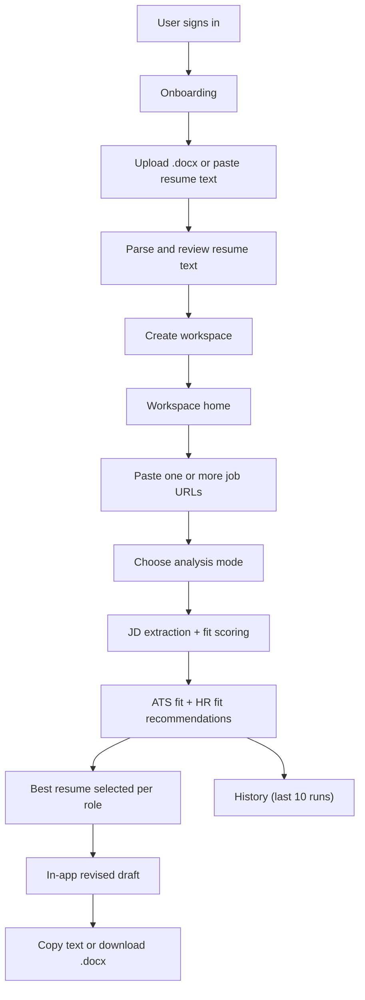

# Mehak's Job Search Model

A browser-native job-matching and resume-personalization product for business-role candidates.

## Core Idea

Before this became a website, I built this as an agent-driven job-search workflow for myself.

The original flow was:
- identify ATS keywords from a job description
- do recruiter-style / HR fit research on the role
- compare that role against my resume
- identify the gaps in my resume
- rewrite the resume more intentionally for that role

That core agent workflow is still the heart of the product.

This repo can still be used in a clone-and-run way by people who want to use the GitHub project directly, but the website is the public-friendly layer I’m building so that the same flow becomes easier to use without needing to understand the repo deeply.

## Original Job Search Flow

The underlying job-search logic is:

1. Bring in a target job description or job URL.
2. Identify the ATS keywords and concepts in that role.
3. Do HR-style fit research on what the role is likely asking for.
4. Compare those requirements against one or more resumes.
5. Identify missing skills, weak framing, and positioning gaps.
6. Recommend what should change in the resume.
7. Generate a revised draft resume.

That is the product logic I created first.

The website exists to make that same flow:
- more public-friendly
- more user-friendly
- easier to test with more people
- easier to use without relying fully on a terminal workflow

## Live Beta

- Website: [https://jobsearchmodel.vercel.app](https://jobsearchmodel.vercel.app)
- App source: [website](C:/Users/bmeha/OneDrive/Documents/New%20project/jobsearchmodel-publish/website)

This repo is the working product build for my job-search system. The current focus is the website experience: account creation, resume ingestion, role-fit analysis, and in-app resume revision.

## Current Product Status

Current build:
- live beta on Vercel
- account creation and sign-in
- multi-resume onboarding
- `.docx` resume parsing
- workspace creation
- ATS / HR / comprehensive analysis modes
- in-app revised resume drafts
- `.docx` export

In progress:
- production onboarding hardening
- PDF support
- deeper resume-rewrite quality
- broader beta testing

## Product Preview

The clearest screens in the current beta are:
- onboarding flow with profile, targets, ATS preferences, and resume upload
- workspace home with resume selection, job URL input, and analysis mode selector
- analysis results view with ATS fit, HR fit, and revised drafts
- history view for the last 10 runs

Live beta:
- [https://jobsearchmodel.vercel.app](https://jobsearchmodel.vercel.app)

## Product Architecture



## What This Product Is Trying To Do

The goal is to make job search less manual and more decision-driven.

Instead of:
- uploading one resume at a time
- eyeballing whether a role is a fit
- guessing which resume version to use
- rewriting bullets from scratch for every application

the product helps a user:
- upload multiple resumes
- create one workspace
- compare those resumes against one or many job URLs
- understand ATS fit and recruiter fit
- generate a revised draft resume inside the app

In other words:
- the agent logic came first
- the website is the usability layer built around that logic

## Jobs To Be Done

This product is being built to solve these jobs:

1. Help a candidate store multiple resume variants in one place.
2. Convert uploaded resumes into usable text without forcing manual re-entry.
3. Let the user review and edit extracted resume text before saving it.
4. Let the user paste one or many job URLs and analyze them in one run.
5. Show whether a role is a fit from two angles:
   - ATS / keyword match
   - HR / recruiter fit
6. Identify the best resume for each role.
7. Generate revised resume drafts in-app instead of requiring local file editing.
8. Let the user copy the revised text or download a simple Word version.
9. Keep lightweight history so the user can revisit prior analyses.

## User Flow

The intended user flow is:

1. Sign up or sign in with email and password.
2. Complete onboarding:
   - basic profile
   - target roles and preferences
   - ATS keywords and concepts
   - one or more resumes
3. In Step 4, upload `.docx` resumes or paste resume text.
4. Review the extracted text from each uploaded resume.
5. Click `Create Workspace`.
6. Land in the workspace home.
7. Select one or more stored resumes.
8. Paste one or many job URLs.
9. Choose analysis mode:
   - ATS only
   - HR fit only
   - comprehensive
10. Review scorecards, recommendations, and best-fit resume-role matches.
11. Read the auto-generated revised draft for each role.
12. Copy the draft or download it as `.docx`.

## Process Followed In The Product

The product process is:

1. Resume ingestion
   - accept uploaded `.docx` or pasted text
   - parse to text
   - let the user edit before save
2. Workspace creation
   - save profile
   - save matching preferences
   - save parsed resume text
3. Role analysis
   - fetch job description text from pasted URLs
   - compare every selected resume against every role
   - compute ATS and HR fit signals
4. Recommendation layer
   - identify best resume per role
   - summarize strengths, gaps, and red flags
5. Resume revision
   - generate one in-app revised draft per role using the best matching resume
   - offer copy and `.docx` download
6. History
   - keep the last 10 runs

## Current Product Scope

Working now:
- standard email/password auth
- onboarding with multiple resumes
- `.docx` resume parsing
- workspace creation
- multi-resume x multi-role analysis
- ATS-only, HR-fit-only, and comprehensive modes
- in-app revised resume drafts
- `.docx` export
- history for recent runs

Current constraints:
- PDF upload is not in v1 yet
- the product is still in beta stabilization
- resume rewriting quality is still heuristic and can improve further
- the website is optimized for business-role candidates first

## Tech Stack

The current website stack is:

- `Next.js` for the app and API routes
- `Supabase` for auth and database hosting
- `Prisma` for database access
- `mammoth` for `.docx` parsing
- `docx` for Word export

This repo also still contains earlier repo-first workflow pieces, but the active product direction is the website in `website/`.

## Local Development

From the website app:

```bash
cd website
npm install
npm run dev
```

You will also need:
- `DATABASE_URL`
- `DIRECT_URL`
- `NEXT_PUBLIC_SUPABASE_URL`
- `NEXT_PUBLIC_SUPABASE_ANON_KEY`
- `SUPABASE_SERVICE_ROLE_KEY`
- `NEXT_PUBLIC_APP_URL`
- `BETA_INVITE_EMAILS`
- `MAX_SCANS_PER_DAY`

See [website/README.md](C:/Users/bmeha/OneDrive/Documents/New%20project/jobsearchmodel-publish/website/README.md) for website-specific setup notes.

## Why I Built This

I wanted a job-search system that behaves more like a thoughtful operating model than a folder full of resume drafts and scattered notes.

This repo is the product version of that idea:
- structured
- multi-resume
- role-aware
- ATS-aware
- recruiter-aware
- faster to personalize

The website is not the whole idea by itself. It is the more public-facing version of a workflow I originally built through agent-driven job-search analysis, resume gap identification, and resume rewriting.

If you are reviewing this repo, the clearest place to start is the live beta and the website app in `website/`.
