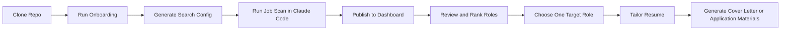

# Mehak's Job Search Model

A public, cloneable job-search system for business-role candidates using Claude Code.

I built this for people targeting roles like:
- Strategy & Operations
- GTM / Revenue / Enablement-adjacent roles
- Program Management
- Strategic Finance and planning-adjacent roles

The goal is simple: make job search more structured, more personalized, and easier to manage.

Instead of manually juggling resumes, job links, dashboards, and notes, this model gives you one repeatable workflow:

1. Scan for jobs
2. Publish fresh results to a dashboard
3. Review and rank the roles
4. Pick a target job
5. Review resume fit
6. Tailor your resume
7. Generate application materials

## Workflow Diagram



## What This Repo Does

This repo helps you:
- organize your search in one place
- match roles using ATS keywords and job-description signals
- keep multiple resume versions
- track fresh jobs in local files or Google Sheets / Notion
- tailor a resume and cover letter for a specific role faster

This is a repo-first system. The repo is the product.

## Who This Is For

This version is built for business-role candidates first. It is best suited for people applying to:
- strategy roles
- operations roles
- GTM or revenue operations roles
- program or strategic initiatives roles
- finance-adjacent planning roles

If your search is mainly for software engineering or other technical IC roles, this public version is not optimized for that yet.

## How The Workflow Works

The intended workflow is:

1. Run onboarding once
2. Add your resume and preferences
3. Generate your search config
4. Run a job scan in Claude Code
5. Publish results to your dashboard if you want one
6. Review the top roles
7. Tailor your resume for the role you want to pursue

In practice, that usually looks like:
- ask Claude Code to run a job scan
- run `node sync-dashboard.mjs --target=sheets`
- ask Claude to rank roles
- ask Claude to tailor `cv.md` for the job you pick

## What The Output Looks Like

Here is the kind of workflow this repo is built around:

### Live Pipeline

| Company | Role | Freshness | Location | Priority |
|---------|------|-----------|----------|----------|
| Together AI | Senior Program Manager, Infrastructure Strategy and Business Operations | 3 days | San Francisco | High |
| SmithRx | Senior Strategic Finance Manager | 2 days | Remote / Bay Area | High |
| Lucid | Strategy & Business Operations Manager | 4 days | Bay Area | Medium |

### Review Queue

| Company | Role | Why it needs review |
|---------|------|---------------------|
| Canva | Program Manager, Strategy and Enablement | date unclear on source page |
| Mixpanel | Revenue Strategy & Operations Manager | freshness needs secondary verification |

The exact jobs will be different for each user, but the structure is the same:
- fresh verified jobs go to the live pipeline
- uncertain jobs go to the review queue
- applied or stale jobs go to the archive view

## Quick Start

Clone the repo and install dependencies:

```bash
git clone https://github.com/mehakfromdelhi/jobsearchmodel.git
cd jobsearchmodel
npm install
npx playwright install chromium
```

Run onboarding:

```bash
npm run onboard
```

The onboarding flow will ask for:
- your name and contact information
- your target functions
- preferred locations
- industries and companies of interest
- ATS keywords and exclusions
- your resume text
- dashboard preference

Then generate your search config:

```bash
npm run refresh-search
node cv-sync-check.mjs
```

After that, open Claude Code in this folder and:
- ask it to run a job scan
- ask it to publish results to your dashboard if needed
- ask it to rank or score the roles
- ask it to tailor your resume for the best-fit role

## First 10 Minutes

If you are new, do this in order:

1. `npm install`
2. `npx playwright install chromium`
3. `npm run onboard`
4. `npm run refresh-search`
5. `node cv-sync-check.mjs`
6. Open Claude Code in this repo
7. Ask Claude to run your first job scan

## Before and After Onboarding

Before onboarding, the repo is just a template.

You will mainly see:
- example config files
- docs
- scripts
- empty or starter folders

After onboarding, the repo becomes your personal workspace.

You will have:
- your own `config/profile.yml`
- your own `config/matching-preferences.json`
- your own `cv.md`
- your own resume variants in `resumes/`
- your own generated `portals.yml`

That is the moment when the model starts feeling personal instead of generic.

## What You Need To Edit

Most users only need to care about three things:

1. `config/profile.yml`
Your identity, role targets, and personal settings

2. `cv.md` and `resumes/`
Your base resume and any role-specific resume variants

3. `config/matching-preferences.json`
Your ATS keywords, target functions, locations, industries, and companies of interest

Everything else is supporting engine logic.

## Key Files

These are the most important files in the repo:

- `config/profile.yml`
Your personalized profile

- `config/matching-preferences.json`
Your matching inputs: keywords, locations, industries, and target functions

- `config/resume-map.md`
Maps resume variants to role families

- `cv.md`
Your active resume

- `resumes/`
Your role-specific resume variants

- `portals.yml`
Your search and scanning policy

- `data/pipeline.md`
Fresh, live jobs you want to review

- `data/review-queue.md`
Relevant jobs that still need freshness verification or manual review

- `data/applications.md`
Your applications tracker

- `sync-dashboard.mjs`
Pushes your local data into Google Sheets or Notion

## Resume Variants

Start with one base resume:

- `cv.md`
- `resumes/base.md`

Then add targeted versions as needed, for example:

- `resumes/strategy-ops.md`
- `resumes/gtm-ops.md`
- `resumes/program-management.md`
- `resumes/strategic-finance.md`

To switch the active version:

```bash
npm run resume -- base
```

Or replace `base` with the variant you want to activate.

## Dashboard Options

Dashboards are optional.

You can use this repo in three ways:

1. Local-only
Use the markdown and TSV files inside the repo as your source of truth.

2. Google Sheets
Best option if you want a simple, easy-to-navigate dashboard.

3. Notion
Optional if you prefer a database-style workspace.

The local files remain the source of truth in all cases.

## Typical User Journey

A typical day-to-day flow looks like this:

1. Ask Claude to run a new job scan
2. Publish the updated results to your dashboard
3. Review the fresh jobs in `data/pipeline.md` or your Sheet
4. Ask Claude to rank the best options
5. Pick one target role
6. Ask Claude to review your fit
7. Ask Claude to tailor your resume and generate a cover letter

## Example Prompts To Use In Claude Code

Once you have finished onboarding, you can say things like:

- `Run a fresh job scan for me`
- `Publish the latest pipeline to Google Sheets`
- `Rank the jobs in my live pipeline`
- `Tailor my resume for this job URL`
- `Compare these two roles`
- `Draft a cover letter for this role`
- `Switch me to my strategic-finance resume`

## Public Clone Flow

If someone else wants to use this repo, their path should be:

1. Clone the repo
2. Install dependencies
3. Run onboarding
4. Paste their resume
5. Add their ATS keywords and location preferences
6. Generate the search config
7. Open Claude Code and run a scan
8. Optionally connect Google Sheets or Notion

They should not need to manually edit deep engine files to get started.

## Example Walkthrough

Here is a simple example of how another person might use the repo:

1. Clone the repo
2. Run `npm install`
3. Run `npm run onboard`
4. Paste a resume targeted to strategy and operations
5. Add keywords like `business operations`, `strategic planning`, `program management`, and `financial modeling`
6. Add preferred locations like `San Francisco` and `New York`
7. Run `npm run refresh-search`
8. Open Claude Code and say `Run a fresh job scan for me`
9. Publish the results to Google Sheets
10. Ask Claude to rank the top three jobs
11. Pick one role and say `Tailor my resume for this job URL`

That full path is the main user experience this repo is built for.

## Common Mistakes

These are the most common ways new users get stuck:

- forgetting to run `npm run onboard`
- forgetting to run `npm run refresh-search` after onboarding
- expecting dashboard sync to work before creating `.env`
- never updating the default ATS keywords to match their own search
- trying to tailor resumes before they have picked a real target role

The fastest path is:

1. onboard
2. refresh search
3. run a scan
4. review the pipeline
5. tailor for one real role

## Docs

- [Setup](docs/SETUP.md)
- [Guided Onboarding](docs/ONBOARDING.md)
- [ATS Keywords](docs/ATS_KEYWORDS.md)
- [Dashboard Sync](docs/DASHBOARD_SYNC.md)
- [Example Personas](docs/PERSONAS.md)
- [Customization Guide](docs/CUSTOMIZATION.md)

## Website App

A browser-native product scaffold now lives in `website/`.

Use it if you want to evolve the repo into:
- a landing page
- magic-link sign-in
- onboarding flow
- dashboard and job detail pages
- resume manager
- settings and integrations

To run it locally:

```bash
cd website
npm install
npm run dev
```

For the zero-cost beta version:
- use `Vercel Hobby`
- use `Supabase Free`
- keep scans manual only
- keep the website as the personal dashboard
- skip Google Sheets and Notion for now

## Security Notes

- This repo ships with placeholders only in `.env.example`
- Do not commit your real `.env`
- Do not commit personal resumes you do not want public
- Do not commit generated private tracker data unless you intend to share it
- If you connect Google Sheets or Notion, keep those credentials local

## Why I Built This

I wanted a job-search system that felt more like an operating model than a folder of documents. This repo is meant to help candidates run a more intentional search with better matching, clearer prioritization, and faster personalization.

If you clone it, make it yours. Update the keywords, resumes, locations, and role targets around your own search.
