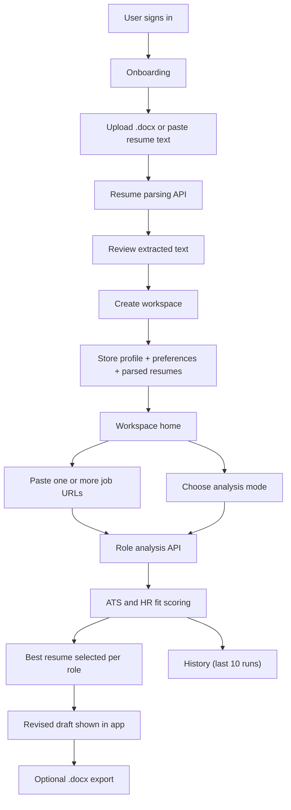

# Architecture

## Summary

The product is now centered on the website in `website/`, not the older repo-first scan workflow.

It is a browser-native system for:
- user authentication
- resume ingestion
- workspace creation
- multi-resume role analysis
- in-app revised resume generation
- recent-run history

## High-Level Flow

## Main Subsystems

### 1. Auth

- `Supabase Auth`
- email/password sign-up and sign-in
- authenticated user session gates onboarding, workspace, history, and resumes

### 2. Onboarding

- collects profile, target roles, ATS keywords, and resumes
- supports multiple resumes
- supports `.docx` parsing plus manual text paste
- saves parsed text only

### 3. Workspace

- main logged-in home
- shows stored resumes
- accepts one or many job URLs
- lets the user choose:
  - ATS only
  - HR fit only
  - comprehensive

### 4. Analysis

- extracts JD content from submitted URLs
- compares every selected resume against every role
- computes ATS and HR fit
- identifies best resume per role

### 5. Revised Drafts

- generates one in-app draft per role using the best matching resume
- does not save rewritten files locally
- supports copy and `.docx` export

### 6. History

- stores the last 10 runs
- lets users revisit prior analyses and revised drafts

## Storage Model

The core persisted data is:
- user
- profile
- matching preferences
- resume variants
- analysis runs
- feedback

The product currently stores:
- parsed resume text
- not the original uploaded source file

## Current Boundaries

Included:
- website-based role matching
- resume upload and parsing
- role-fit scoring
- revised resume drafts

Deferred:
- PDF support
- OCR
- broader job discovery workflows
- external dashboard integrations as the main experience
