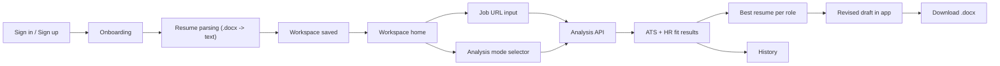

# Website App

This is the active product surface for Mehak's Job Search Model.

Live beta:
- [https://jobsearchmodel.vercel.app](https://jobsearchmodel.vercel.app)

## Current Product Status

Working now:
- Vercel deployment
- Supabase auth and database connection
- multi-resume onboarding
- `.docx` parsing
- workspace creation
- ATS-only, HR-fit-only, and comprehensive analysis
- in-app revised drafts
- `.docx` export
- history page

Still being hardened:
- production onboarding reliability
- full auth and password-reset polish
- richer revision quality
- PDF support

## Key Screens

The main screens in the current beta are:
- onboarding
- workspace home
- results / revised draft view
- history

## Website Architecture



## What The Website Does

The website is designed to help a user:
- create an account
- upload multiple resumes
- create a workspace
- paste one or many job URLs
- choose ATS, HR-fit, or comprehensive analysis
- compare multiple resumes against multiple roles
- get revised resume drafts in-app

## Jobs To Be Done

1. Ingest resumes in a format the product can use reliably.
2. Let the user review extracted resume text before saving it.
3. Build a clean workspace from profile, keywords, and parsed resumes.
4. Analyze fit across many resumes and many roles in one run.
5. Explain both ATS fit and recruiter fit.
6. Recommend the best resume for each role.
7. Generate revised resume drafts without writing local files.
8. Let the user download drafts as `.docx` when needed.

## User Flow

1. Sign in or sign up.
2. Complete onboarding.
3. In Step 4, upload `.docx` resumes or paste text manually.
4. Review extracted text.
5. Click `Create Workspace`.
6. Land in the workspace home.
7. Select resumes and paste job URLs.
8. Choose analysis mode:
   - ATS only
   - HR fit only
   - comprehensive
9. Review fit results.
10. Read the auto-generated revised drafts.
11. Copy or download the draft as `.docx`.

## Stack

- `Next.js`
- `Supabase`
- `Prisma`
- `mammoth`
- `docx`

## Run Locally

```bash
cd website
npm install
npm run dev
```

Required env vars:
- `DATABASE_URL`
- `DIRECT_URL`
- `NEXT_PUBLIC_SUPABASE_URL`
- `NEXT_PUBLIC_SUPABASE_ANON_KEY`
- `SUPABASE_SERVICE_ROLE_KEY`
- `NEXT_PUBLIC_APP_URL`
- `BETA_INVITE_EMAILS`
- `MAX_SCANS_PER_DAY`
